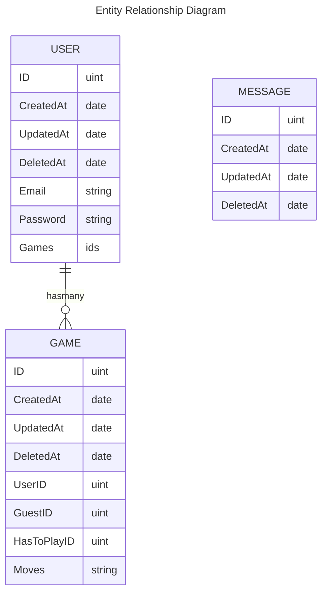

# Backend

## Install Go
https://go.dev/doc/install

## Install PostgreSQL

installation:
```bash
sudo apt-get update
sudo apt-get install postgresql
```

## Init database
https://dev.to/karthikeyan_/install-and-configure-postgresql-with-golang-2ldi

run postgres:
```bash
sudo service postgresql start
sudo -u postgres psql
```

check your `./.env` file and replace:
- `<myuser>` with `POSTGRES_USER`
- `<mydb>` with `POSTGRES_DB`
- `<mypassword>` with `POSTGRES_PASSWORD`

```sql
CREATE USER <myuser> WITH PASSWORD '<mypassword>';
CREATE DATABASE <mydb>;
GRANT ALL PRIVILEGES ON DATABASE <mydb> TO <myuser>;
```

## Run the REST API
```bash
go run .
```

## Useful

### PostgreSQL commands 

connect to chess db with psql:
```bash
sudo -u postgres psql -d <mydb>
```

\l                  show dbs
\c <dbname>         choose a db
\exit               exit
\conninfo           get connexion info
\password <dbname>  change db pw
\dt                 show tables
\conninfo           show current db user, socket and port
\du                 show users

### SQL queries

```sql
SELECT * FROM users;  -- show all rows in users table
INSERT INTO users (email, password) VALUES ('test@test.com', 'super-pw');
```


